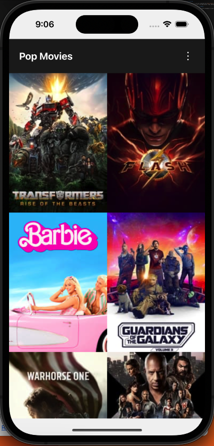
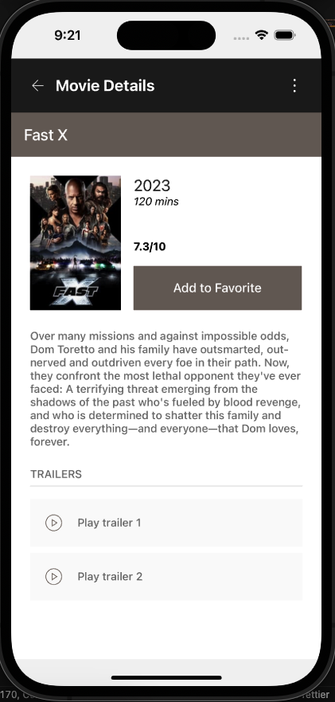

# Getting Started

> **Note**: Make sure you have completed the [React Native - Environment Setup](https://reactnative.dev/docs/environment-setup) instructions till "Creating a new application" step, before proceeding.

## Step 1: Setup environment variables

First, you will need to set environment variables in .env file.

```bash
IMAGE_URL=https://image.tmdb.org/t/p/
API_KEY=[Your API Key]
```

## Step 2: Start your Application

### For Android

```bash
npx react-native run-android
```

### For iOS

```bash
npx react-native run-ios
```

**Pagination**:
When you scroll to end, then it will load next page, and you can see more videos.



